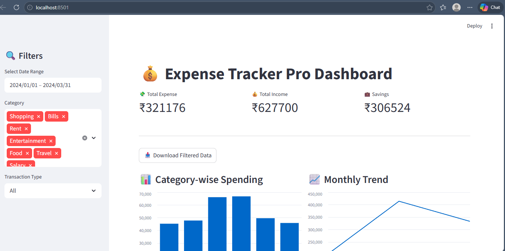
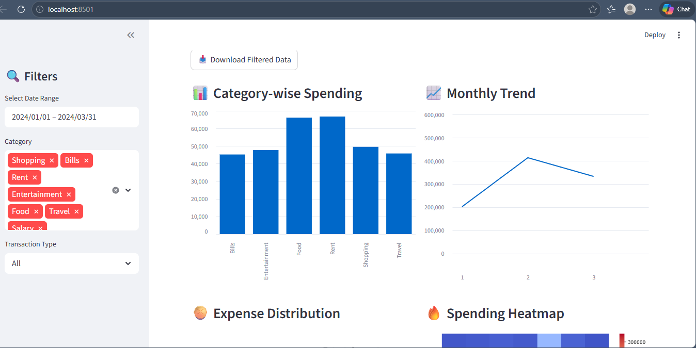
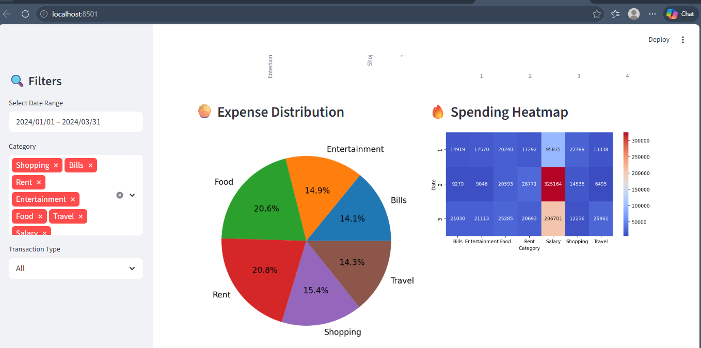

# 💰 Expense Tracker App (Data Science Project)

## 📌 Project Overview

The **Expense Tracker App** is a data-driven application designed to help users track, analyze, and visualize their financial transactions.
It enables better financial decision-making through insights into spending patterns, category distribution, and monthly trends.

This project simulates real-world financial analytics systems used in FinTech platforms such as Google Pay, Paytm, and CRED.

---

## 🎯 Problem Statement

Managing personal and business expenses without structured insights is difficult.
Raw financial data (receipts, transaction logs, CSV files) is hard to interpret and does not provide actionable insights.

### ❗ Challenges:

* Lack of visibility into spending habits
* Difficulty in tracking category-wise expenses
* No clear understanding of monthly trends
* Poor financial decision-making

---

## 💡 Solution

This project converts raw expense data into meaningful insights using:

* Data cleaning and preprocessing
* Exploratory Data Analysis (EDA)
* Data visualization
* Interactive dashboard (Streamlit)

---

## 🚀 Features

* 📊 KPI Dashboard (Total Expense, Income, Savings)
* 🎯 Category-wise spending analysis
* 📈 Monthly trend visualization
* 🥧 Expense distribution (Pie Chart)
* 🔥 Heatmap for spending patterns
* 🔍 Interactive filters (Category, Date, Type)
* 📥 Download filtered data
* 📌 Smart insights (overspending detection)
* 📂 Raw data viewer

---

## 🧠 Tech Stack

### 👨‍💻 Programming & Analysis

* Python
* Pandas
* NumPy

### 📊 Visualization

* Matplotlib
* Seaborn

### 🌐 Dashboard

* Streamlit

---

## 🏗️ Project Architecture

```
User Input / Synthetic Data
        ↓
     CSV Storage
        ↓
 Data Cleaning & Processing
        ↓
   Data Analysis (EDA)
        ↓
 Visualization Layer
        ↓
    Dashboard UI
        ↓
   Insights & Decisions
```

---

## 📁 Project Structure

```
Expense-Tracker-App/
│
├── data/                  # Raw and cleaned datasets
│   ├── expenses.csv
│   └── cleaned_expenses.csv
│
├── notebooks/             # Jupyter notebooks for EDA
│   └── expense_analysis.ipynb
│
├── outputs/               # Generated charts
│   ├── category_bar.png
│   ├── pie_chart.png
│   ├── monthly_trend.png
│   └── heatmap.png
│
├── images/                # Screenshots for README
│   └── dashboard.png
│
├── app.py                 # Streamlit dashboard
├── main.py                # Data generation & analysis script
├── requirements.txt       # Dependencies
└── README.md
```

---

## ⚙️ Installation & Setup

### 🔹 Step 1: Clone Repository

```bash
git clone https://github.com/Tejaswini747/Expense-Tracker-App-Data-Science.git
cd Expense-Tracker-App-Data-Science
```

### 🔹 Step 2: Create Virtual Environment

```bash
python -m venv venv
venv\Scripts\activate   # Windows
```

### 🔹 Step 3: Install Dependencies

```bash
pip install -r requirements.txt
```

---

## ▶️ How to Run

### 🔹 Generate Data & Analysis

```bash
python main.py
```

### 🔹 Run Dashboard

```bash
streamlit run app.py


## 🔬 Key Insights

* Identified highest spending category
* Detected overspending patterns
* Observed monthly financial trends
* Provided actionable recommendations


## 📸 Screenshots





## 🧪 Simulation Approach

Since real financial data is not accessible:

* Synthetic data was generated using NumPy
* Randomized transactions simulate real-world behavior
* Categories include:

  * Food
  * Travel
  * Rent
  * Shopping
  * Bills
  * Entertainment

---

## 📈 Business Impact

* Helps users control spending
* Enables better budgeting decisions
* Identifies cost-saving opportunities
* Mimics real-world FinTech analytics systems

---

## 🚀 Future Enhancements

* 🤖 AI-based spending prediction
* 📱 Mobile app integration
* 🔔 Budget alerts & notifications
* 🏦 Bank API integration
* 👤 User authentication system

---

## 🧠 Interview Questions

**Q1: Why did you use synthetic data?**
Because real financial datasets are not publicly available due to privacy concerns.

**Q2: Which library was most useful?**
Pandas for data manipulation and aggregation.

**Q3: How do you detect overspending?**
By comparing total expense vs income and identifying high-spend categories.

---

## 🤝 Contribution

Contributions are welcome!
Feel free to fork the repository and submit a pull request.

---

## 📜 License

This project is open-source and available under the MIT License.

---

## 🙌 Acknowledgements

* Inspired by real-world FinTech applications
* Built as a Data Science portfolio project

---

## ⭐ If you like this project

Give it a star ⭐ on GitHub and share it!

---
